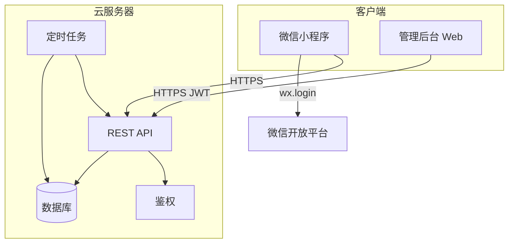

# 考研学习记录系统 — 需求与实施方案

> **文档版本**：v1.5  
> **更新日期**：2026-06-01  
> **适用范围**：微信小程序、云服务器 API、网页管理后台  
> **用途**：作为全项目需求基线、技术选型依据与分阶段开发计划；后续 AI/人工开发均以本文为准，变更需更新版本号并记录修订说明。

---

## 目录

1. [项目概述](#1-项目概述)
2. [系统边界与角色](#2-系统边界与角色)
3. [功能需求](#3-功能需求)
4. [非功能需求](#4-非功能需求)
5. [技术架构](#5-技术架构)
6. [数据模型](#6-数据模型)
7. [API 设计概要](#7-api-设计概要)
8. [界面与交互要点](#8-界面与交互要点)
9. [鉴权与安全](#9-鉴权与安全)
10. [定时任务与消息](#10-定时任务与消息)
11. [部署与运维](#11-部署与运维)
12. [目录结构规范](#12-目录结构规范)
13. [接口与编码约定](#13-接口与编码约定)
14. [待确认产品决策](#14-待确认产品决策)
15. [分阶段实现计划](#15-分阶段实现计划)
16. [测试验收清单](#16-测试验收清单)
17. [二期 backlog](#17-二期-backlog)
18. [修订记录](#18-修订记录)

---

## 1. 项目概述

### 1.1 背景

为考研学员提供**学习计划查看**与**每日学习上报**能力；管理员通过网页后台为指定成员维护学习计划表；云服务器统一处理数据存储、业务逻辑与定时提醒。

### 1.2 建设目标（MVP）

| 目标 | 说明 |
|------|------|
| 计划可视 | 学员在微信小程序查看「当天 / 本周 / 全部」计划 |
| 学习上报 | 学员自行填写当日完成情况、学习时长等 |
| 计划管理 | 管理员在 Web 后台为指定成员维护学习计划 |
| 数据集中 | 所有数据经云服务器 API 入库，便于统计与提醒 |

### 1.3 系统组成

```
┌─────────────────┐     HTTPS      ┌─────────────────┐
│  微信小程序      │ ──────────────► │  云服务器 API    │
│  （学员端）      │                 │  + 数据库        │
└─────────────────┘                 │  + 定时任务      │
                                    └────────▲────────┘
┌─────────────────┐     HTTPS               │
│  网页管理后台    │ ─────────────────────────┘
│  （管理员）      │
└─────────────────┘
```

### 1.4 MVP 范围外（首期不做）

- 社区、论坛、题库、直播
- 支付、会员、多机构 SaaS
- 复杂数据分析大屏（仅保留基础统计）

---

## 2. 系统边界与角色

### 2.1 角色定义

| 角色 | 使用端 | 权限概要 |
|------|--------|----------|
| **学员** | 微信小程序 | 查看自己的计划；提交/查看自己的学习上报 |
| **管理员** | 网页管理后台 | 管理成员账号；为指定成员 CRUD 学习计划与计划项；查看统计 |

### 2.2 账号与绑定

- 学员账号由**管理员创建**或后台录入后，首次微信登录时绑定 `openid`（推荐 MVP 方案，见 [14. 待确认产品决策](#14-待确认产品决策)）。
- 管理员账号独立于微信，使用账号密码 + JWT 登录后台。

---

## 3. 功能需求

### 3.1 微信小程序（学员端）

#### 3.1.1 登录

- 调用 `wx.login` 获取 `code`，提交服务端换取会话凭证（token）。
- 未绑定学员：提示联系管理员开通（或展示绑定流程，按产品决策实现）。

#### 3.1.2 底部 Tab 结构（三栏）

小程序底部固定 **3 个 Tab**，从左到右：

| 位置 | Tab 名称 | 页面 | 说明 |
|------|----------|------|------|
| **左** | 计划 | `pages/plan/plan` | 学习计划展开：默认 **月历视图**，并支持「本周」「全部」列表 |
| **中** | 今日 | `pages/home/home` | **进入小程序的首个界面**（`pages` 数组第一项）；友好信息提示与当日完成情况 |
| **右** | 我的 | `pages/mine/mine` | 登录、累计/本周学习时长、完成任务数等 |

> 原「计划」「上报」分 Tab 方案已合并：**上报操作在计划页**完成；**今日 Tab** 侧重提示与概览。

#### 3.1.3 今日（信息提示首页）

- **默认启动页**：用户打开小程序首先进入「今日」Tab。
- **当日进度**：环形或数字展示「已完成 / 总任务」。
- **智能提示文案**：根据 **当日任务完成情况** 与 **当日剩余时间** 动态变化，例如：
  - 无任务、全部完成、时间充裕、下午冲刺、临近结束等场景；
  - 提示用户前往「计划」页记录学习。
- **今日任务速览**：最多展示若干条任务及「已完成 / 未完成」状态（只读）；提供按钮跳转「计划」Tab。
- **不负责完整上报表单**（上报在计划页完成）。

#### 3.1.4 计划（今日 / 本周 / 全部 + 上报）

**视图模式**（顶部切换，默认「今日」）：

| 模式 | 说明 |
|------|------|
| **今日** | **仅展示当天**计划任务列表；**唯一可编辑视图**：学习记录、其他学习等操作仅在此进行 |
| **本周** | **只读**：按周一至周日分组展示任务，不可点击上报、不可新增 |
| **全部** | **只读**：月历选日查看历史/未来任务，不可上报、不可新增；选中日为今天时提示跳转「今日」 |

**日历日状态与颜色**（「全部」模式，图例说明）：

| 状态 | 含义 | 建议色 |
|------|------|--------|
| 无计划 | 当日无 `plan_items` | 默认白/灰底 |
| **未完成** | 有计划项，存在未上报或未完成任务 | 橙/黄系 |
| **已完成** | 当日计划项均已上报完成 | 绿系 |
| **超额完成** | 当日实际上报总时长 > 计划目标总时长，或业务标记为超额 | 紫系 |

**交互**：

- **今日**：点击任务 → **学习记录** 面板；支持「其他学习」；可选填 **开始时间、结束时间**（选填，可自动推算时长）；
- **本周 / 全部**：仅浏览、不可上报；**点击任务弹出详情窗**，分「计划信息」「上报记录」展示全部字段（含开始/结束时间、备注等）；当日任务可一键跳转「今日」记录；
- **上报日期**：学员端 `POST /reports` 的 `reportDate` 仅限 **当天**（服务端需校验）。

每条计划项展示字段：

- 科目、任务内容、目标时长（分钟）、计划日期
- 完成状态、实际上报时长（已报时）

#### 3.1.5 权限与分工（小程序 vs 管理后台）

| 能力 | 微信小程序 | 网页管理后台 |
|------|------------|--------------|
| 查看今日/本周/全部计划 | ✅ | ✅ |
| 学习记录、其他学习上报 | ✅（仅「今日」） | — |
| 新增/修改/删除计划与计划项 | ❌ | ✅ |
| 成员账号、批量排课 | ❌ | ✅ |

> 学员不能在小程序中修改非当日任务；**管理后台不可省略**（除非改为纯个人自学产品）。

#### 3.1.6 学习上报（业务规则）

- 在 **计划页 · 今日** 发起：关联 `plan_item_id` 或「其他学习」。
- 字段：**是否完成**、**实际学习时长（分钟）**、**开始时间 / 结束时间（可选）**、**备注（可选）**；其他学习另填科目与内容描述。
- 提交后刷新日历日状态、今日首页进度。
- **同日同任务上报策略**：见 [14.3](#143-上报规则)；默认覆盖更新。

#### 3.1.7 我的

- **微信登录** / 退出；
- 展示：**累计学习时长**、**本周学习时长**、**完成任务数**、**连续打卡天数**（API：`GET /stats/summary`）；
- 入口：学习记录（二期）、跳转计划 Tab。

#### 3.1.8 通用体验

- 加载中、空数据、网络错误、未登录等状态提示。

---

### 3.2 云服务器（API + 数据 + 定时）

#### 3.2.1 核心职责

- 接收小程序与管理后台的 HTTPS 请求。
- 用户鉴权、计划与上报的 CRUD、统计查询。
- 数据库持久化与迁移管理。
- 定时任务：扫描未上报用户、触发提醒（二期可接微信订阅消息）。

#### 3.2.2 业务规则

- 学员只能访问 **user_id = 当前登录用户** 的计划与上报。
- 管理员可操作所有学员数据；敏感操作写操作日志（建议二期）。
- 计划项 `date` 必须在所属计划的 `start_date` ~ `end_date` 范围内（校验）。

---

### 3.3 网页管理后台（管理员）

#### 3.3.1 登录与权限

- 管理员账号密码登录，JWT 存储于前端（httpOnly Cookie 或 localStorage，按安全方案选型）。
- 路由守卫：未登录跳转登录页。

#### 3.3.2 成员管理

- 列表：昵称、手机号、状态（启用/禁用）、是否已绑定微信。
- 新增/编辑/禁用成员。
- 为成员指定或查看其学习计划列表。

#### 3.3.3 学习计划管理

- 为**指定成员**创建学习计划：`标题`、`开始日期`、`结束日期`。
- 计划项管理：按日期维护多条记录。
  - 字段：`日期`、`科目`、`任务内容`、`目标时长（分钟）`、`排序号`。
- 支持编辑、删除计划及计划项。
- **效率功能（可选 MVP+）**：复制某日计划到一周；按日期范围批量生成空白行。

#### 3.3.4 数据查看

- 查看某成员的上报记录、完成率、总学习时长（简版报表）。

---

## 4. 非功能需求

| 类别 | 要求 |
|------|------|
| 可用性 | MVP 核心流程（登录→看计划→上报）3 步内完成 |
| 性能 | 列表接口 P95 &lt; 500ms（单用户百级计划项） |
| 安全 | 全站 HTTPS；接口鉴权；管理端强密码；生产环境密钥不入库 |
| 兼容 | 微信小程序基础库按官方建议最低版本 |
| 可维护 | 三端分目录；API 文档与迁移脚本随代码版本管理 |
| 备份 | 生产数据库每日自动备份（部署阶段落实） |

---

## 5. 技术架构

### 5.1 推荐技术栈

| 层级 | 技术选型 | 说明 |
|------|----------|------|
| 小程序 | **uni-app (Vue 3) + 微信小程序** | 与仓库命名一致；后续可扩展 H5 |
| 管理后台 | **Vue 3 + Vite + Element Plus** | 表格、表单、权限成熟 |
| 服务端 | **Node.js（NestJS 或 Express）** 或 **Python（FastAPI）** | 全项目统一一种；推荐 Node 与前端栈一致 |
| 数据库 | **PostgreSQL** 或 **MySQL 8** | 按日期、用户查询需建索引 |
| 缓存（可选） | Redis | 会话、限流、定时任务锁 |
| 定时任务 | node-cron / 系统 cron | 每日提醒扫描 |
| 部署 | 云服务器 + Nginx + HTTPS | 满足小程序合法域名要求 |

### 5.2 逻辑架构图



### 5.3 环境划分

| 环境 | 用途 |
|------|------|
| local | 本地开发 |
| staging | 联调、体验版小程序 |
| production | 正式上线 |

---

## 6. 数据模型

### 6.1 ER 关系（文字）

- `users` 1 ── N `study_plans`
- `study_plans` 1 ── N `plan_items`
- `users` 1 ── N `study_reports`
- `plan_items` 0..1 ── N `study_reports`（上报可关联具体计划项）

### 6.2 表结构

#### users（用户）

| 字段 | 类型 | 说明 |
|------|------|------|
| id | PK | 主键 |
| openid | string, nullable, unique | 微信 openid，未绑定时为空 |
| nickname | string | 昵称 |
| phone | string, nullable | 手机号 |
| role | enum | `student` \| `admin` |
| status | enum | `active` \| `disabled` |
| created_at / updated_at | datetime | 时间戳 |

#### study_plans（学习计划）

| 字段 | 类型 | 说明 |
|------|------|------|
| id | PK | 主键 |
| user_id | FK → users | 所属学员 |
| title | string | 计划名称，如「政治冲刺」 |
| start_date | date | 开始日期 |
| end_date | date | 结束日期 |
| created_by | FK → users | 创建的管理员 |
| created_at / updated_at | datetime | 时间戳 |

#### plan_items（计划明细）

| 字段 | 类型 | 说明 |
|------|------|------|
| id | PK | 主键 |
| plan_id | FK → study_plans | 所属计划 |
| date | date | 计划日期 |
| subject | string | 科目 |
| content | text | 任务描述 |
| target_minutes | int | 目标时长（分钟） |
| sort_order | int | 排序，默认 0 |
| created_at / updated_at | datetime | 时间戳 |

**索引建议**：`(plan_id, date)`、`(plan_id, date, sort_order)`；学员侧查询需通过 `study_plans.user_id` 关联。

#### study_reports（学习上报）

| 字段 | 类型 | 说明 |
|------|------|------|
| id | PK | 主键 |
| user_id | FK → users | 学员 |
| plan_item_id | FK, nullable | 关联计划项，可空表示自由填报 |
| report_date | date | 上报日期 |
| completed | boolean | 是否完成 |
| actual_minutes | int | 实际学习时长 |
| start_time | time, nullable | 学习开始时间（可选） |
| end_time | time, nullable | 学习结束时间（可选） |
| note | text, nullable | 备注 |
| created_at / updated_at | datetime | 时间戳 |

**唯一约束（默认方案）**：`UNIQUE(user_id, plan_item_id, report_date)` 其中 `plan_item_id` 为 NULL 时按业务另定（自由填报可用 `user_id + report_date + plan_item_id IS NULL` 一条）。

#### notifications_log（提醒记录，二期）

| 字段 | 类型 | 说明 |
|------|------|------|
| id | PK | 主键 |
| user_id | FK | 用户 |
| type | string | 如 `daily_remind` |
| status | enum | sent / failed |
| sent_at | datetime | 发送时间 |

---

## 7. API 设计概要

统一前缀建议：`/api/v1`。详细路径与请求体在 `docs/api-spec.md` 开发阶段补充。

### 7.1 认证

| 方法 | 路径 | 说明 |
|------|------|------|
| POST | `/auth/wx-login` | body: `{ code }`，返回 token + 用户信息 |
| POST | `/auth/admin-login` | body: `{ username, password }` |
| GET | `/me` | 当前登录用户信息 |

### 7.2 学员 — 计划（只读）

| 方法 | 路径 | 说明 |
|------|------|------|
| GET | `/plans/today` | 当天计划项列表 |
| GET | `/plans/week` | 本周计划项，可按日分组 |
| GET | `/plans/all` | 全部计划，query: `page`, `pageSize` |
| GET | `/plans/day` | 指定日计划，query: `date=YYYY-MM-DD` |
| GET | `/plans/month` | 月历汇总（二期），query: `year`, `month`，返回每日状态 |

### 7.3 学员 — 统计

| 方法 | 路径 | 说明 |
|------|------|------|
| GET | `/stats/summary` | 累计时长、本周时长、完成任务数、连续打卡等 |

### 7.4 学员 — 上报

| 方法 | 路径 | 说明 |
|------|------|------|
| POST | `/reports` | 创建或更新上报（`reportDate` 必须为当天，否则 403） |
| GET | `/reports/today` | 今日上报列表 |
| GET | `/reports` | 历史上报，query: `page`, `pageSize`, `from`, `to` |

上报 body 扩展字段：`isOther`、`otherSubject`、`otherContent`（其他学习时）。

### 7.5 管理端

| 方法 | 路径 | 说明 |
|------|------|------|
| GET/POST/PATCH | `/admin/users` | 成员 CRUD |
| GET/POST/PATCH/DELETE | `/admin/plans` | 计划 CRUD |
| GET/POST/PATCH/DELETE | `/admin/plan-items` | 计划项 CRUD |
| GET | `/admin/stats/users/:id` | 成员统计 |

### 7.6 系统

| 方法 | 路径 | 说明 |
|------|------|------|
| GET | `/health` | 健康检查 |

---

## 8. 界面与交互要点

### 8.1 小程序信息架构

```
TabBar（左 → 右）
├── 计划 pages/plan/plan
│   ├── 今日：可上报、其他学习（唯一可写）
│   ├── 本周 / 全部：只读查看
│   └── 全部：月历选日浏览
├── 今日 pages/home/home          ← 启动首页（pages 数组第一项）
│   ├── 当日进度环 + 智能提示（结合剩余时间）
│   ├── 今日任务速览
│   └── 跳转「计划」记录学习
└── 我的 pages/mine/mine
    ├── 微信登录
    ├── 累计/本周时长、任务数、连续打卡
    └── 学习记录（二期）
```

### 8.2 管理后台信息架构

```
登录
└── 布局（侧栏）
    ├── 成员管理
    ├── 学习计划（按成员筛选 → 计划列表 → 计划项编辑）
    └── 数据统计（简版）
```

### 8.3 关键交互

- 计划列表项展示完成状态徽章（已报/未报）。
- 上报页时长使用数字输入，单位分钟。
- 管理端计划项表格支持按日期排序、内联编辑（可选）。

---

## 9. 鉴权与安全

| 端 | 机制 |
|----|------|
| 小程序 | `Authorization: Bearer <token>`，token 由 wx-login 签发 |
| 管理后台 | JWT，role 必须为 `admin` |
| 微信 | AppSecret 仅存服务端环境变量 |

**安全要求**：

- 生产禁用 mock openid。
- 管理接口与学员接口可用路由前缀 + 中间件隔离。
- CORS 仅允许管理后台域名；小程序走域名白名单，不依赖 CORS。
- 密码 bcrypt 存储；登录失败限流（建议）。

---

## 10. 定时任务与消息

### 10.1 MVP

- 每日固定时间（如 20:00）扫描：当日有 plan_item 但未产生 `study_reports` 的 active 学员。
- 结果写入日志表或仅打日志（首期可不发消息）。

### 10.2 二期

- 接入微信**订阅消息**：用户曾在小程序授权对应模板。
- 发送记录写入 `notifications_log`。

---

## 11. 部署与运维

| 项 | 说明 |
|----|------|
| API | Docker 或 PM2，监听内网端口，Nginx 反代 |
| HTTPS | Let's Encrypt 或云证书 |
| 小程序 | 微信公众平台配置 request 合法域名为 API 域名 |
| 管理后台 | 静态资源部署至 `admin.xxx.com` 或同域 `/admin` |
| 数据库 | 云 RDS 或自建，每日备份 |
| 环境变量 | `DATABASE_URL`, `JWT_SECRET`, `WX_APPID`, `WX_SECRET` 等 |

---

## 12. 目录结构规范

```
jiankalka-kaoyan/
├── miniapp/              # uni-app 微信小程序
├── server/               # API 服务 + 迁移 + 定时任务
├── admin/                # Vue 管理后台
├── docs/                 # 项目文档（本文档、API 规范、部署说明）
│   ├── 考研学习记录系统-需求与实施方案.md   # 本文档
│   ├── api-convention.md       # 阶段 0 补充
│   ├── api-spec.md             # 阶段 1+ 补充
│   ├── test-checklist.md       # 阶段 7 补充
│   └── deploy.md               # 阶段 5 补充
└── README.md             # 项目入口说明，指向 docs
```

---

## 13. 接口与编码约定

### 13.1 统一响应格式

```json
{
  "code": 0,
  "message": "ok",
  "data": {}
}
```

- `code === 0` 表示成功；非 0 为业务错误，HTTP 状态码仍可为 200 或按 4xx/5xx 映射（全项目统一一种）。
- 列表分页：`data: { list: [], total: number, page: number, pageSize: number }`

### 13.2 错误码段（建议）

| 区间 | 含义 |
|------|------|
| 0 | 成功 |
| 10001–10099 | 参数错误 |
| 20001–20099 | 认证/权限 |
| 30001–30099 | 业务错误（未绑定、计划不存在等） |
| 50000+ | 服务器内部错误 |

### 13.3 命名与分支

- 数据库表名、字段：snake_case。
- API JSON 字段：camelCase（或 snake_case 全项目统一一种）。
- Git 分支：`main` 生产；`develop` 集成；功能分支 `feature/阶段-x-简述`。

---

## 14. 待确认产品决策

开发前请确认并在本文档修订记录中落稿：

### 14.1 学员账号

- [ ] **A**：仅管理员创建，微信首次登录绑定（推荐 MVP）
- [ ] **B**：允许微信自助注册，管理员审核

### 14.2 计划粒度

- [ ] **A**：日期 + 科目 + 任务描述 + 目标时长（推荐）
- [ ] **B**：增加时段（上午/下午/晚上）

### 14.3 上报规则

- [ ] **A**：同一用户 + 同一 plan_item + 同一自然日 → 覆盖更新（推荐）
- [ ] **B**：允许多次上报累加时长

### 14.4 提醒

- [ ] **A**：首期仅后台查看统计，不做推送
- [ ] **B**：首期即做微信订阅消息

---

## 15. 分阶段实现计划

**原则**：完成当前阶段验收后，再进入下一阶段。管理后台先于小程序，确保有计划测试数据。

### 阶段 0：项目初始化与规范（约 0.5 天）

| 序号 | 任务 | 交付物 |
|:---:|---|---|
| 0.1 | 创建 `miniapp/`、`server/`、`admin/` | 目录与 README |
| 0.2 | 环境变量模板 `.env.example` | 三端可 install |
| 0.3 | 编写 `docs/api-convention.md` | 响应格式、错误码 |
| 0.4 | 数据库本地/云库连通 | 空库可连 |

**验收**：三端可启动；`GET /health` 可访问。

---

### 阶段 1：服务端基础 + 数据库（约 1–2 天）

| 序号 | 任务 | 交付物 |
|:---:|---|---|
| 1.1 | 建表迁移 | migration 脚本 |
| 1.2 | 全局异常、日志、health | 服务骨架 |
| 1.3 | 管理端登录 + JWT + 种子管理员 | 可获取 token |
| 1.4 | 微信登录（可先 mock，阶段 4 替换） | `POST /auth/wx-login` |

**验收**：Postman 可登录管理员；可插入测试用户与计划。

---

### 阶段 2：管理后台 — 用户与计划（约 2–3 天）

| 序号 | 任务 | 交付物 |
|:---:|---|---|
| 2.1 | 登录页、布局、路由守卫 | 可登录 |
| 2.2 | 成员列表 CRUD | 用户管理页 |
| 2.3 | 计划与计划项 CRUD | 计划管理页 |
| 2.4 | 批量/复制（可选） | 录入效率 |
| 2.5 | 对接真实 API | 端到端 |

**验收**：管理员可为测试学员录入一周计划。

---

### 阶段 3：服务端 — 学员 API（约 1–2 天）

| 序号 | 任务 | 交付物 |
|:---:|---|---|
| 3.1 | `GET /plans/today|week|all` | 三个接口 |
| 3.2 | `POST /reports` 及覆盖策略 | 上报写入 |
| 3.3 | `GET /reports/today`、历史分页 | 回显 |
| 3.4 | `GET /admin/stats/users/:id` | 简版统计 |

**验收**：测试学员 token 可拉计划并上报；后台可见数据。

---

### 阶段 4：微信小程序（约 3–4 天）

| 序号 | 任务 | 交付物 |
|:---:|---|---|
| 4.1 | uni-app 初始化、请求封装 | 工程骨架 |
| 4.2 | 微信登录联调 | 真实 openid |
| 4.3 | 计划三视图 | 列表 UI |
| 4.4 | 上报页 | 提交联调 |
| 4.5 | 我的 / 历史 | 闭环 |
| 4.6 | 空态与错误处理 | 可体验 |

**验收**：真机预览完整流程；后台可见上报。

---

### 阶段 5：部署与域名（约 1 天）

| 序号 | 任务 | 交付物 |
|:---:|---|---|
| 5.1 | API 生产部署 | 生产 URL |
| 5.2 | HTTPS + Nginx | 合法域名 |
| 5.3 | 小程序后台域名配置 | 体验版可用 |
| 5.4 | 管理后台构建部署 | admin 可访问 |
| 5.5 | 数据库备份策略 | 运维说明 |

**验收**：体验版连生产环境走通核心流程。

---

### 阶段 6：定时提醒（约 1–2 天，可二期）

| 序号 | 任务 | 交付物 |
|:---:|---|---|
| 6.1 | 每日未上报扫描 | cron |
| 6.2 | 微信订阅消息 | 模板消息 |
| 6.3 | 管理端仪表盘 | 打卡率趋势 |

---

### 阶段 7：测试与文档（约 1 天）

| 序号 | 任务 | 交付物 |
|:---:|---|---|
| 7.1 | `docs/test-checklist.md` | 测试清单 |
| 7.2 | `docs/deploy.md` | 部署文档 |
| 7.3 | README 与已知问题 | 交付说明 |

---

### 时间粗估（MVP，阶段 0–5 + 7）

| 阶段 | 天数 |
|------|:---:|
| 0 | 0.5 |
| 1 | 1–2 |
| 2 | 2–3 |
| 3 | 1–2 |
| 4 | 3–4 |
| 5 | 1 |
| 7 | 1 |
| **合计** | **约 10–14 天** |

---

### AI 分阶段执行 Prompt 模板

```
项目：考研学习记录（miniapp + server + admin）
当前阶段：阶段 X — [名称]
技术栈：按 docs/考研学习记录系统-需求与实施方案.md 第 5 节
要求：仅完成阶段 X 任务表，不提前做下一阶段
参考：docs/api-convention.md（若已存在）
交付：变更文件列表、本地启动步骤、验收步骤
```

---

## 16. 测试验收清单

### 16.1 管理端

- [ ] 管理员登录成功/失败提示正确
- [ ] 创建学员、禁用学员生效
- [ ] 为学员创建计划及多条计划项
- [ ] 修改、删除计划项后小程序侧数据一致

### 16.2 服务端

- [ ] 学员 token 无法访问 `/admin/*`
- [ ] 学员 A 无法读取学员 B 的计划与上报
- [ ] 上报覆盖策略符合 [14.3](#143-上报规则) 约定

### 16.3 小程序

- [ ] 微信登录成功，未绑定用户有明确提示
- [ ] 当天/本周/全部计划数据正确
- [ ] 提交上报后列表状态更新
- [ ] 弱网/断网有错误提示

### 16.4 部署

- [ ] 生产 HTTPS 可访问
- [ ] 体验版小程序 request 无域名报错
- [ ] 数据库备份可恢复验证（演练一次）

---

## 17. 二期 backlog

- 微信订阅消息提醒
- 计划模板库、Excel 导入导出
- 多管理员角色与操作审计
- 科目维度统计图表
- 学员自助修改部分计划字段（若业务需要）

---

## 18. 修订记录

| 版本 | 日期 | 作者 | 说明 |
|------|------|------|------|
| v1.5 | 2026-06-01 | — | 美化今日上报表单；本周/全部改为弹窗展示完整上报信息 |
| v1.4 | 2026-06-01 | — | 上报增加可选时段；本周/全部支持展开任务详情 |
| v1.3 | 2026-06-01 | — | 小程序仅「今日」可上报/记录；本周、全部只读 |
| v1.2 | 2026-06-01 | — | 计划页拆为今日/本周/全部；月历仅用于「全部」 |
| v1.1 | 2026-06-01 | — | 小程序三 Tab：计划、今日（提示首页）、我的；合并上报至计划页 |
| v1.0 | 2026-06-01 | — | 初稿：需求、架构、数据模型、分阶段计划 |

---

**文档维护说明**：任何需求变更、技术选型调整、产品决策确认后，须更新对应章节并递增版本号，在本表追加一行修订记录。
